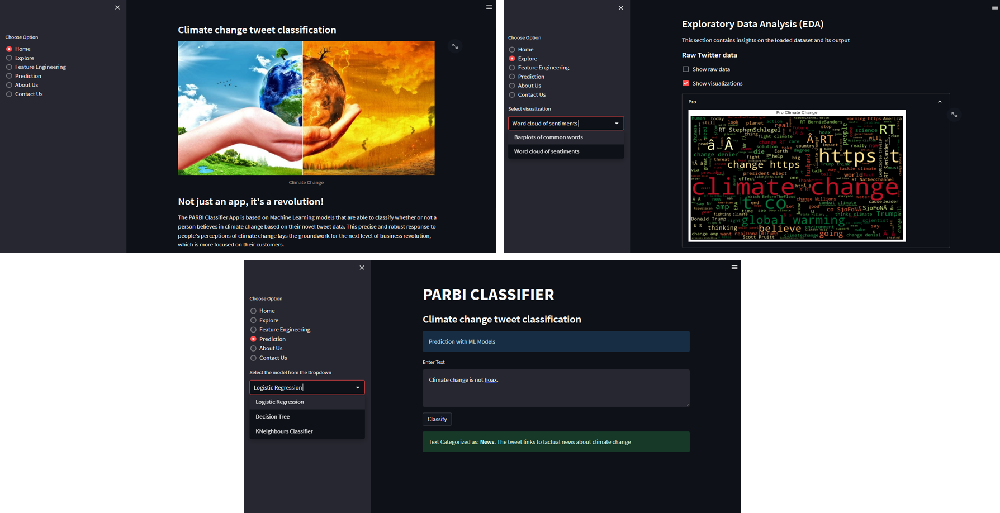

# Portfolio
---
## Data Science

### South Africa Language Classification

 South Africa is a multilingual country with 11 official languages. We developed a system that is capable of processing texts written in South African languages and identifying which specific language among the 11 official languages is being used.

 

 

---
### Climate Change Sentiments Classification 

.ipynb)

 This project developed climate change classifier models that predict the sentiment of Twitter users towards climate change, using a dataset consisting of thousands of tweets. The predictions generated by these models provide insights into how people perceive climate change and whether they consider it a real threat. This information enables industries to assess how their products or services may be received. Such knowledge forms the basis of most companies' market strategies, as they aim to produce widely accepted commodities that will drive their sales. I built an interacticve web app for the models on streamlit and hosted it on aws EC2 instance 

 

 

---
